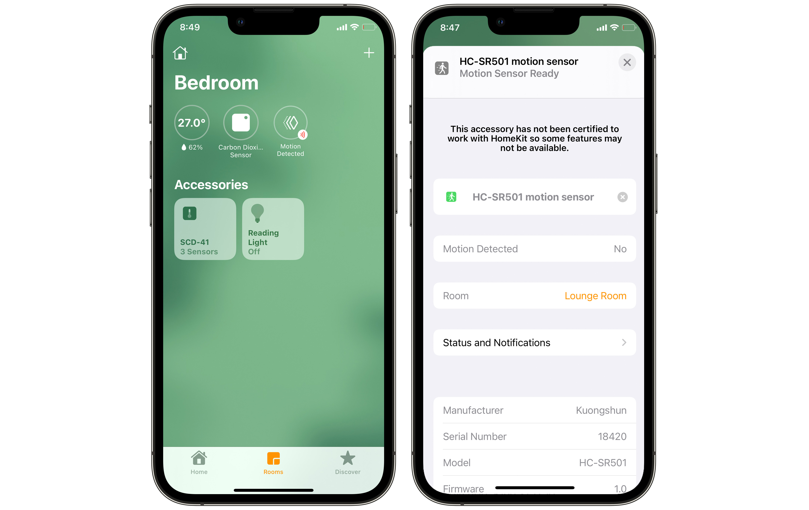

# HomeKit HC-SR501 PID motion sensor

An [Apple HomeKit](https://developer.apple.com/homekit/) accessory for the [HC-SR501](https://core-electronics.com.au/modmypi-pir-infrared-motion-sensor-hc-sr501.html) PID motion sensor running on a Raspberry Pi.

## Dependencies

* [**Go**](http://golang.org/doc/install) - this accessory is written in Go
* [**HomeControl**](https://github.com/brutella/hc) - to expose sensor readings as an Apple HomeKit accessory

## Installation

Install this on a Raspberry Pi, or test it on macOS.

### Setup

1. Install [Go](http://golang.org/doc/install) >= 1.14 ([useful Gist](https://gist.github.com/pcgeek86/0206d688e6760fe4504ba405024e887c) for Raspberry Pi)
1. Clone this project: `git clone https://github.com/sighmon/homekit-hcsr501` and then `cd homekit-hcsr501`
1. Install the Go dependencies: `go get`

### Build

1. To build this accessory: `go build homekit-hcsr501.go`
1. To cross-compile for Raspberry Pi on macOS: `env GOOS=linux GOARCH=arm GOARM=7 go build homekit-hcsr501.go`

### Run

1. Execute the executable: `./homekit-hcsr501`
1. Or run with the command: `go run homekit-hcsr501.go`

### Start automatically at boot

1. sudo cp homekit-hcsr501.service /lib/systemd/system/homekit-hcsr501.service
2. sudo systemctl daemon-reload
3. sudo systemctl enable homekit-hcsr501.service
4. sudo systemctl start homekit-hcsr501.service

### Optional flags

The flag defaults can be overridden by handing them in at runtime:

* `-pin=23` The pin your HC-SR501 sensor is connected to
* `-dev` This turns on development mode to return a random motion response without needing to have a HC-SR501

e.g. to override the pin run: `go run homekit-hcsr501.go -pin=18` or `./homekit-hcsr501 -pin=18`

## Reset this accessory

If you uninstall this accessory from your Apple Home, you'll also need to delete the stored data for it to be able to be re-added.

### macOS

1. Delete the data in the folder created: `homekit-hcsr501/HC-SR501/` 
1. Restart the executable

### Raspberry Pi

1. Remove the persistent data: `rm -rf /var/lib/homekit-hcsr501/data`
1. Restart the Raspberry Pi

## Thanks

This project uses the amazing work of [Matthias](https://github.com/brutella). Please consider donating if you found this useful.
